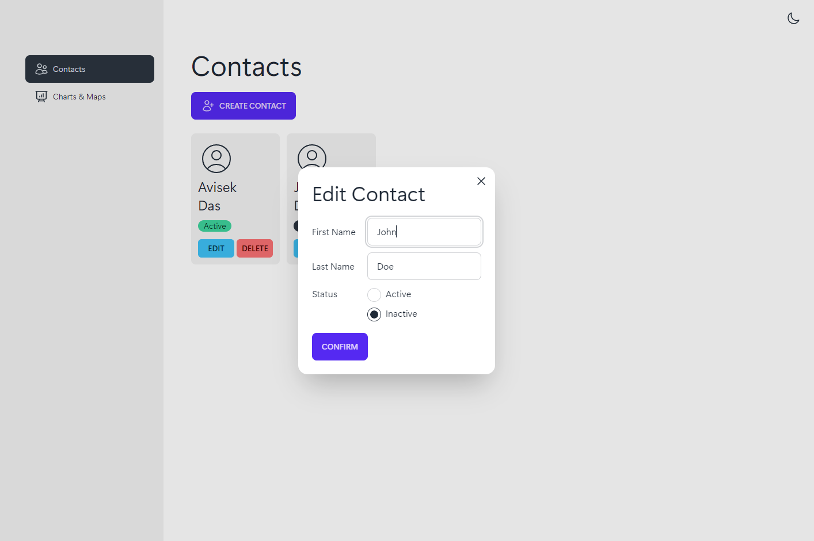

# Contact Management App with Charts and Maps

<table>
  <tr>
    <td style="border: 0px;">
      
    </td>
    <td style="border: 0px;">
      
    </td>
  </tr>
</table>

## Table of Contents

- [Introduction](#introduction)
- [Features](#features)
- [Technologies Used](#technologies-used)
- [Setup and Usage](#setup-and-usage)
- [APIs Used](#apis-used)
- [Contributing](#contributing)
- [License](#license)

## Introduction

Welcome to the Contact Management App with Charts and Maps! This application is a practical demonstration of modern web development techniques, featuring a comprehensive contact management system with integrated COVID-19 data visualizations.

## Features

- **Contacts Page:**
  - Add, view, edit, and delete contacts.
  - Efficient state management using Redux.
- **Charts and Maps Page:**
  - Interactive line graph showing COVID-19 case fluctuations.
  - Dynamic map with country-specific COVID-19 data.
  
## Technologies Used

- **ReactJS**: Building reusable UI components.
- **TypeScript**: Ensuring type-checking and robust code.
- **TailwindCSS**: Styling the application for a sleek and responsive design.
- **React Router v6**: Managing application routing.
- **React Query (TanstackQuery)**: Efficiently handling API calls and data management.

## Setup and Usage

1. **Clone the Repository:**

```bash
git clone https://github.com/avisek/mapchart-contacts.git
cd mapchart-contacts
```

2. **Install Dependencies:**

```bash
npm install
```

3. **Start the Development Server:**

```bash
npm start
```

4. **Access the Application:**
Open your web browser and navigate to [http://localhost:3000](http://localhost:3000) to use the app.

## APIs Used

To provide real-time COVID-19 data, this app utilizes the following APIs:

- [Disease.sh - Global Cases](https://disease.sh/v3/covid-19/all): World-wide COVID-19 data.
- [Disease.sh - Country Cases](https://disease.sh/v3/covid-19/countries): Country-specific COVID-19 data.
- [Disease.sh - Historical Data](https://disease.sh/v3/covid-19/historical/all?lastdays=all): Historical data for creating case trend graphs.

## Contributing

Contributions are welcome! If you'd like to contribute to this project, please follow these steps:

1. Fork the repository.
2. Create a new branch for your feature or bug fix.
3. Make your changes and commit them.
4. Push your changes to your forked repository.
5. Submit a pull request with a clear description of your changes.

## License

This project is licensed under the [MIT License](LICENSE).
